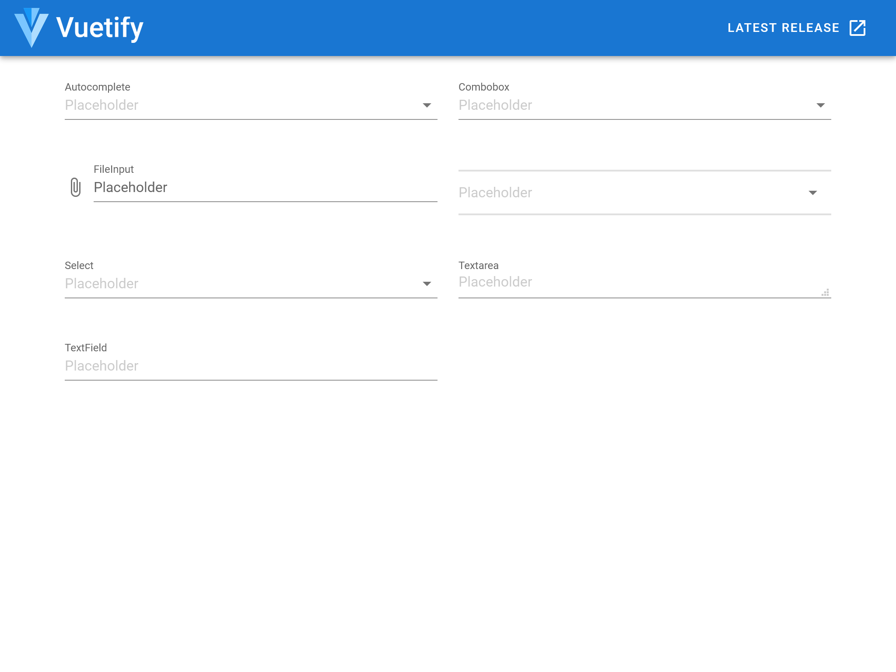
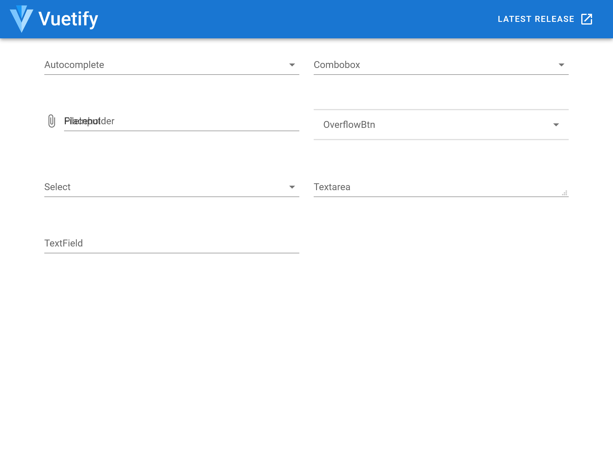
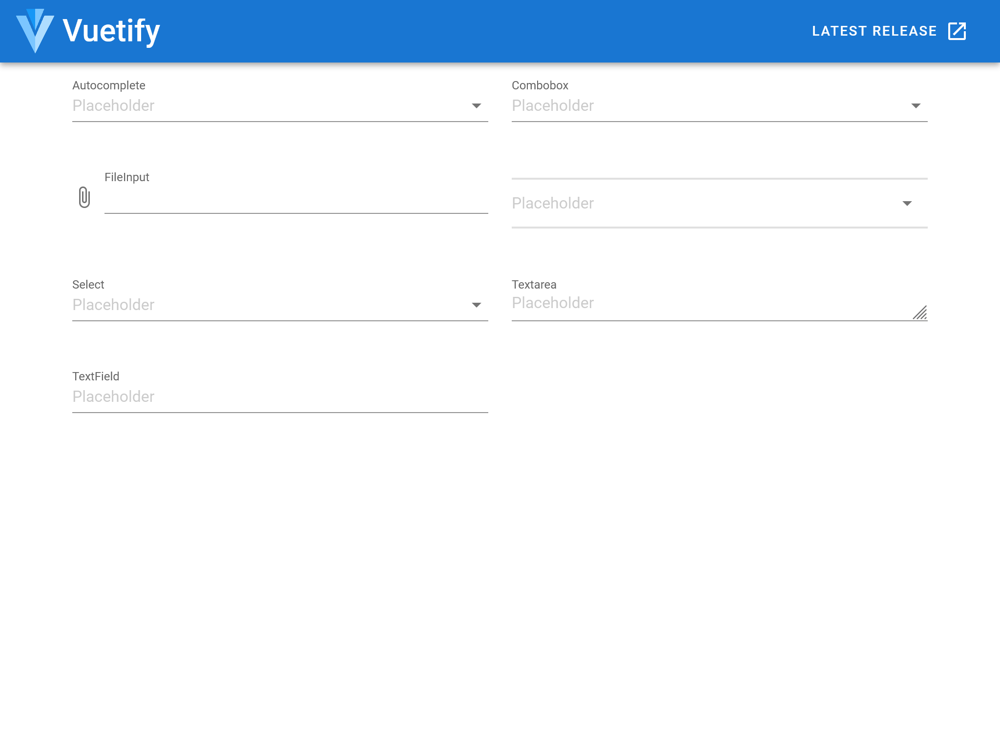

# vuetify-demo

This is a minimal demo to reproduce the behavior changes of placeholder after Vuetify v2.4.0.

## Project setup
```
npm install
```

### Start development server
```
npm run dev
```

:warning: Massive deprecation warning would appear due to the [Breaking Change: Slash as Division](https://sass-lang.com/documentation/breaking-changes/slash-div) in new version of `sass`.

## Affected components

* `v-autocomplete`
* `v-combobox`
* `v-file-input`
* `v-overflow-btn`
* `v-select`
* `v-textarea`
* `v-text-field`

## Diff between versions

* `npm i vuetify@2.3.23` works fine



* `npm i vuetify@2.4.0` placeholders disappeared, `v-file-input` misplaced.



* `npm i vuetify@2.5.1` fixed most of the behaviors by introducing `persistent-placeholder`, but **placeholders of `v-file-input` and `v-select` are still missing after applying `persistent-placeholder`**.


* `npm i vuetify@2.5.5` props `persistent-placeholder` now works on `v-select`, but **placeholders of `v-file-input` is still missing after applying `persistent-placeholder`**.



## Related issues

* [#12839](https://github.com/vuetifyjs/vuetify/issues/12839) [Feature Request] persistent-placeholder for VTextField
* [#13169](https://github.com/vuetifyjs/vuetify/issues/13169) [Bug Report] Placeholder text on empty v-select no longer forces label into field border
* [#13666](https://github.com/vuetifyjs/vuetify/issues/13666) [Bug Report][2.5.0] VSelect not showing persistent placeholder
* [#13792](https://github.com/vuetifyjs/vuetify/issues/13792) [Bug Report][2.5.3] v-select doesn't display placeholder when setting persistent-placeholder
